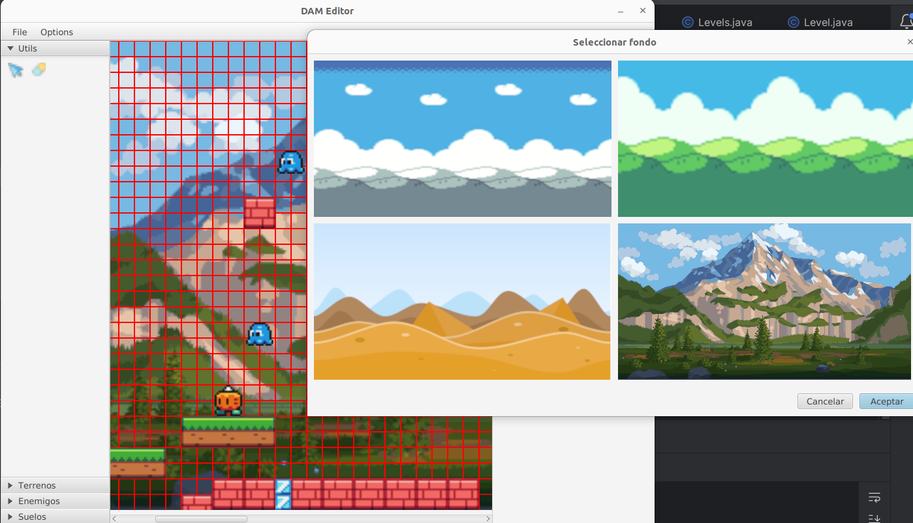

# Módulo Acceso a Datos
## UP1. Trabajando con ficheros.


### Introducción

La empresa AlcachofaGames está desarrollando una serie de juegos de tipo plataforma. Actualmente los diseñadores
pasan los niveles a los programadores que codifican cada juego en código, perdiendo mucho tiempo, además de ser
complicado modificar cada uno de los juegos.
Se está desarrollando un editor visual y nos han encargado desarrollar la parte que almacena y carga los juegos en
el editor, en formato binario, XML y JSON, además de poder generar un HTML con una representación de los niveles.




### Resultados de aprendizaje y criterios de evaluación.

RA1. Desarrolla aplicaciones que gestionan información almacenada en ficheros
identificando el campo de aplicación de los mismos y utilizando clases específicas

* CEa. Se han utilizado clases para la gestión de ficheros y directorios.
* CEb. Se han valorado las ventajas y los inconvenientes de las distintas formas de acceso.
* CEc. Se han utilizado clases para recuperar información almacenada en ficheros.
* CEd. Se han utilizado clases para almacenar información en ficheros.
* CEe. Se han utilizado clases para realizar conversiones entre diferentes formatos de ficheros.
* CEf. Se han previsto y gestionado las excepciones.
* CEg. Se han probado y documentado las aplicaciones desarrolladas.

### Preparando el entorno. (2 puntos)

#### Fondos. (0,75 punto)
Cada juego posee un fondo, anteriormente los fondos se incluian en la carpeta resource y por tanto se 
añadian al jar, con lo que incluir nuevos fondos requería volver a compilar.
Ahora se dispone de una carpeta assets/backgrounds (que usando Gradle se añade de forma externa a la compilación)
en la que se pueden dejar las imágenes. 

> Se ha de desarrollar el código necesario para que se obtengan las rutas de esas imagenes de forma que se muestren en el programa.
>
>Añadir el código necesario en el método de la clase App.java:

 ```java 
 private ArrayList<ImageWithPath> loadBackgroundFromDirectory(String path){}
```

> Documentar el proceso.

#### Elementos/bloques (1,25 puntos)

Cada juego posee una serie de elementos o bloques, esto bloques representas los elementos arrastrables 
del juego, si por ejemplo, se está creando el juego de Mario Bross serían las tuberias, el mástil final,
los enemigos...

Cada juego pueda tener su propio conjunto de elementos, definidos en un ficheor json, se ofrece como ejemplo *** app/assets/blocks.json ***

Este fichero json define:

1. Path: imagen de la que se toman los elementos.
2. Blocks: Grupos de bloques de la aplicación (es un hash), para añadirlos a la aplicación clasificados.
   1. Grupo: Nombre del grupo al que pertenece.
      1. Elemento/bloque: Nombre del bloque y los pixels que definen el rectángulo para obtenerlo
``` json

{
  "path": "build/assets/elementos.png",

  "blocks": {
    "Utils": {
      "Borrador": {
        "minX": 164.0,
        "minY": 177.0,
        "width": 8.0,
        "height": 8.0
      },
      "Puntero": {
        "minX": 175.0,
        "minY": 176.0,
        "width": 8.0,
        "height": 8.0
      }
    },
    "Terrenos": {
      "TierraPequenya": {
        "minX": 256.0,
        "minY": 80.0,
        "width": 16.0,
        "height": 16.0
      },
      "TierraGrande": {
        "minX": 208.0,
        "minY": 48.0,
        "width": 48.0,
        "height": 16.0
      },
      "CuadradoHieloPequeny": {
        "minX": 16.0,
        "minY": 96.0,
        "width": 8.0,
        "height": 8.0
      },
      "CuadradoHielo": {
        "minX": 0.0,
        "minY": 96.0,
        "width": 16.0,
        "height": 16.0
      }
    },
    "Enemigos": {
      "Pulpo": {
        "minX": 96.0,
        "minY": 4.0,
        "width": 15.0,
        "height": 12.0
      },
      "Calabaza": {
        "minX": 144.0,
        "minY": 0.0,
        "width": 16.0,
        "height": 16.0
      }
    },
    "Suelos": {
      "SueloVerde": {
        "minX": 32.0,
        "minY": 96.0,
        "width": 16.0,
        "height": 16.0
      },
      "SueloRojo": {
        "minX": 0.0,
        "minY": 112.0,
        "width": 16.0,
        "height": 16.0
      }
    }
  }
}
```

Se ha definido una clase sencilla para representar el fichero:

```java
  public class BlockData {
        String path;
        Map<String, HashMap<String, Rectangle2D>> blocks;
    }
```

> Completar el código necesario para leer el fichero json en el método (teniendo en cuenta que Rectangle2D forma parte
> de JavaFx, es final y no se puede modificar, buscar como conseguirlo (se recomienda usar GSon)):
>
> Documentar el proceso.
```java

public static void loadBlocks(String path)  {
           //blockData se tiene que obtener del fichero json
            //la imagen tiene que ser la que lea del fichero json, no esta
            blockData= new BlocksData();
            img= new  Image(String.valueOf(App.class.getResource("/elementos.png")));
    }
```
### Serializando y deserializando un nivel. (4 puntos)

Se tiene la clase “Level” que representa un  nivel, este nivel tiene:

- size: de la clase Size, representa el tamaño del juego
- elementos: Lista de bloques
- time: Tiempo máximo para superar el nivel en segundos, de tipo doble.
- sound: Path a la canción que sonará en el nivel, es una cadena.
- name: Nombre del nivel, una cadena.
- backgrounimage: De tipo Strign, indica la ruta de la imagen del fondo.

> Añadir el código necesario para serializar y deserializar en ficheros el nivel de la
aplicación en JSON, XML y binario, asociando estas acciones a los botones del menú:
>
> - Save Level.
> 
> - Load Level.
> 
> Documentar el proceso.

Se recomienda usar Gson, JAXP, se han de añadir ***anotaciones y adaptadores*** para la serialización del nivel.

Clase Level, métodos a completar
```java
public static Level load(File file) throws Exception {
        String extension = file.getName().substring(file.getName().lastIndexOf(".") + 1);
        Level m = null;
        if (extension.equals("xml")) {
            //m = Level.loadXML(file);
        } else {
            if (extension.equals("json")) {
                // m = Level.loadJSON(file);
            } else {
                if (extension.equals("bin")) {
                    //m = Level.loadBin(file);
                } else {
                    throw new Exception("Extensión " + extension + " no permitida");
                }
            }
        }
        return m;
    }

    public static void save(Level level, File file) throws Exception {

        String extension = file.getName().substring(file.getName().lastIndexOf(".") + 1);
        if (extension.equals("xml")) {
            //Level.saveXML(levels, file);
        } else {
            if (extension.equals("json")) {
                // Level.saveJSON(levels, file);
            } else {
                if (extension.equals("bin")) {
                    // Level.saveBin(levels, file);
                } else {
                    throw new Exception("Extensión " + extension + " no permitida");

                }
            }

        }
    }
```

Llamada para guardar en la clase App, método private MenuBar createMenu():

```java
   final FileChooser fileChooser = new FileChooser();
            File file = fileChooser.showSaveDialog(scene.getWindow());
            fileChooser.getExtensionFilters().addAll(
                    new FileChooser.ExtensionFilter("XML", "*.xml"),
                    new FileChooser.ExtensionFilter("Json", "*.json"),
                    new FileChooser.ExtensionFilter("Bin", "*.bin")
            );
            if (file != null) {
                try {
                    Level.save(this.levels.getSelected(),file);
                    //Levels.save(this.levels, file);
                } 
    ....
``` 
Llamada para cargar en la clase App, método private MenuBar createMenu():

```java
  File file = fileChooser.showOpenDialog(scene.getWindow());
            if (file != null) {
                try {
                   this.levels= new Levels();
                   this.levels.addLevel(Level.load(file));
                   //para los nives
                   // Levels m = Levels.load(file);
                   // this.levels = m;
                    this.levels.setSelected(0);
                    this.editor.reset();
                    this.editor.setLevel(this.levels.getSelected());
                    this.levelsPanel.reset();
                    this.levelsPanel.setItems(this.levels);
            ...
```

### Serializando y deserializando un niveles. (2 puntos)


Definir en la clase Levels, todo lo necesario para cargar y almacenar conjuntos de niveles implementando los métodos
estáticos save y load. Modificar la clase App, para en vez de guardar/cargar un nivel, guardar/cargar niveles.


### Transformando. (2 puntos)

Ver un fichero en JSON o XML (mucho menos en binario), no da una idea muy buena de los diferentes niveles del juego.

Crear el código necesario (añadiendo una nueva entrada al menú File), para a partir de un fichero XML de nivel, que realice la transformación (por ejemplo, en tabla) para ver el nivel (incluido el tiempo, el fondo y
una cadena con la canción).

Hacer lo mismo, pero a nivel de niveles.

Documentar las clases y los elementos principales del código en la memoria.